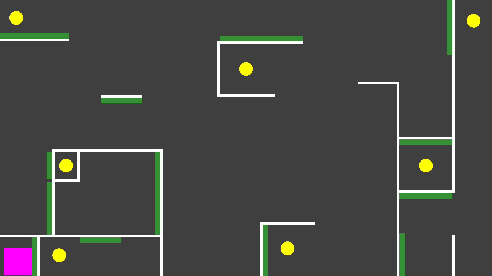

# Abstract
Split Apart is a mini-game prototype to demonstrate a unique gameplay mechanic for a puzzle platformer. This demo was created for a class project for George Mason University's CS 325: Introduction to Game Design in the Fall 2025 semester.

This main mechanic for this demo is the ability for the player to split themself into two clones. It is meant to be a versatile, all-in-one, low skill floor, high skill ceiling mechanic. There are a lot of sub-mechanics which adds to the complexity and usability of this mechanic, including but not limited to:
* Players can aim where they want to split, increasing control.
* Upon splitting, each clone gets a speed boost, acting as a built-in "dash".
* Players can re-combine clones into one and choose which of the clones to combine at.
* Clones are smaller, move faster, but jump lower than the original.
* Clones can be controlled independently of one another.

Essentially, think Agar.io + Fireboy and Watergirl as a single mechanic!

This demo includes 2 tutorial levels to get players used to the complex controls required for this mechanic and 3 mechanically complete and playable levels to showcase the potential usage of this mechanic. You can download and play the demo below!

# Screenshots

  
  
  
  
  

# Video Demo

# Author Profile
 
 
 " Thanh Nguyen is a student at George Mason University majoring in both Computer Science and Math. He loves all things related to video games, including playing them and making them. With his limited art skills, he prefers to work on the programming and design side of things. Besides games, he also has a vested interest in math, specifically pure math and theoretical computer science. " 
 

# Third-Party Assets
All assets were made with Unity's built-in assets.
